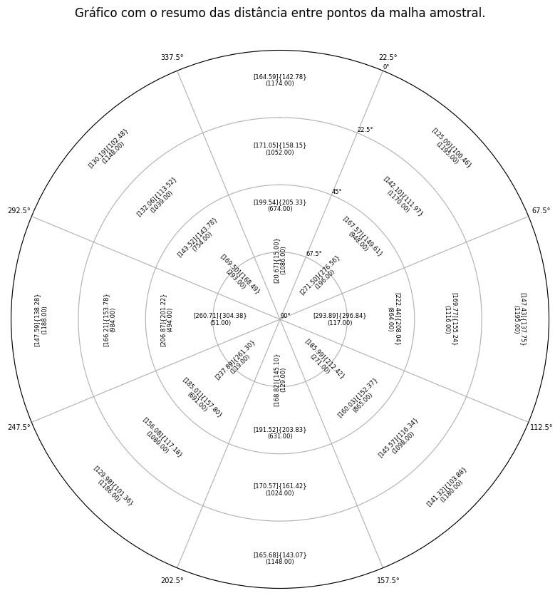

# Project: Distance Between

This is a simple project to generate a graphic that displays the distance between all point of a mineral deposit, imported from a text file.

The text file must contain the coordinates of each point in meters.

The graph displays the following distances:

- The azimuth grouped in 45º;
- The dip grouped in 22.5º;
- The mean inside square brackets [];
- The median inside curly brackets {};
- The total number of calculated pairs inside round brackets ();




## Installation

To install this repository there are two ways:
- Download the repository ZIP file and unpack it inside the vagrant directory of the virtual machine.
- Or clone the repository

```sh
$ $ git clone https://github.com/rccmodena/log-analysis.git
$ cd distance_between/
```

## Requirements

This project was implemented in a **Jupyter Notebook** with **Python 3.7.16**.

The Python Standard Libraries used:
- [math](https://docs.python.org/3/library/math.html#module-math)
- [csv](https://docs.python.org/3/library/csv.html)

Other Libraries used:
- [matplotlib - 3.0.3]()
- [numpy - 1.16-2]()

## TODO

- Translate the comments in the jupyter notebook to English;
- Refactor the code to:
  - enhance the performance;
  - best practices;
  - follow the PEP 8;
- Create a python script to access outside the Jupyter Notebook;
- May create a web interface for the script.


## How to Contribute

If you find any bug or have a suggestion for another resources, feel free to improve this project.

First, you have to fork this repository.

Next, clone this repository to your computer to make the changes.

Once you've pushed changes to your local repository, you can issue a pull request.

## License

The contents of this repository are covered under the [MIT License](LICENSE).
